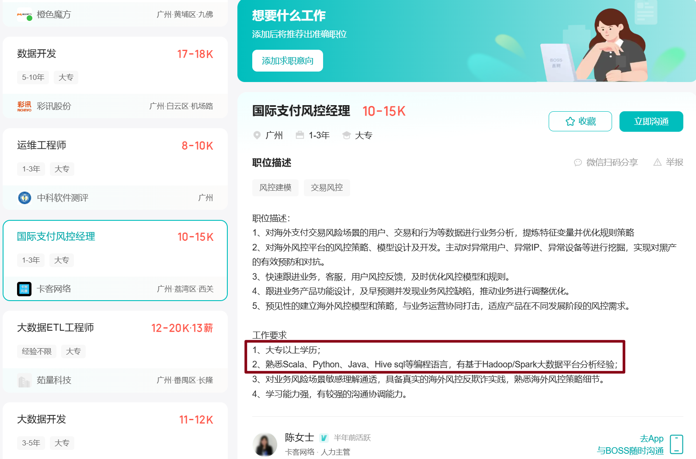

# 你好 Scala !

## 1、为什么选择scala

## 2、版本选择长期维护版本

这里可以下载所有版本的 Scala

[All Available Versions | The Scala Programming Language](https://scala-lang.org/download/all.html)

## 3、安装 Scala 步骤

[安装网址： Scala 2.11.12 | The Scala Programming Language](https://scala-lang.org/download/2.11.12.html)

下载解压后配置环境变量 

验证安装成功

