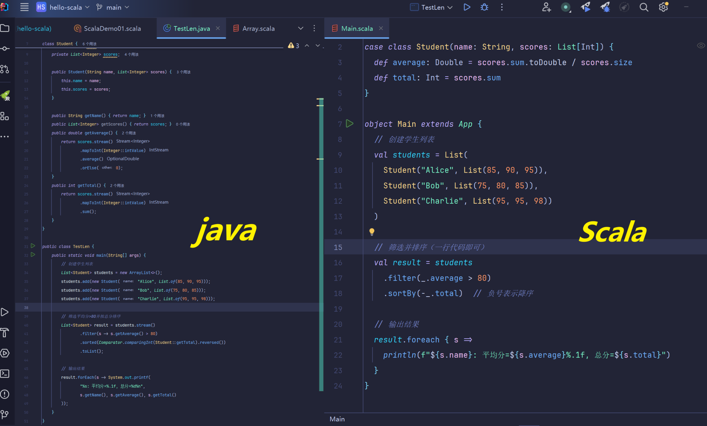
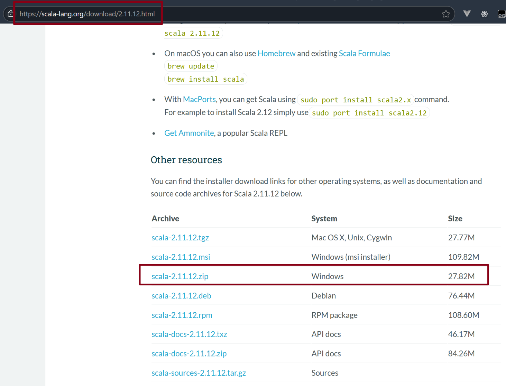

# 你好 Scala !

## 1、为什么选择scala


万物皆对象，编写起来很简洁，轻松调用java类库




## 2、版本选择长期维护版本


这里可以下载所有版本的 Scala

[All Available Versions | The Scala Programming Language](https://scala-lang.org/download/all.html)


## 3、安装 Scala 步骤


[安装网址： Scala 2.11.12 | The Scala Programming Language](https://scala-lang.org/download/2.11.12.html)



下载解压后配置环境变量 


验证安装成功


这里我们再额外安装一个源码后面会有一个高频操作会使用

下载 scala-sources-2.11.12.tar.gz	Sources


## 4、常规的Scala开发方式

Idea 启动！

直接创建一个java项目，注意看我的设置：

### （1）创建项目


### （2） idea中 安装Scala 插件并重启


如果想安装其他版本的scala插件可以看： [Scala Plugin for IntelliJ IDEA & Android Studio | JetBrains Marketplace](https://plugins.jetbrains.com/plugin/1347-scala/versions)


### （3）新建Scala文件夹并标记


（4）添加scala框架支持

这里是最关键一步， *操作成功即可直接再idea创建 scala 文件*


## 5、编写一个Scala代码试试

新建一个单例对象


这里为了大家更好学习scala，我们配置一下源码反编译，编译后续学习

把之前下载好的 scala-sources-2.11.12.tar.gz copy到我们 Scala 环境下，然后直接解压


再次点击就成功了！


## 6、基础语法讲解


#### （1）定义方法：

def 方法名字(参数名字：参数类型):返回类型 = { 方法体 }

#### （2）循环：

for (变量名 <- 开始 to 结束) { ... }

变量名 <- 就是将后面序列每个元素都依次赋值给这个变量

比如Java的   for (int i = 1; i <= 9; i++)


## 7、小案例：NineNine乘法表

参考的java代码：

```java
public class MultiplicationTable {
  public static void main(String[] args) {
    for (int i = 1; i <= 9; i++) {        // 外层循环
      for (int j = 1; j <= i; j++) {      // 内层循环
        System.out.print(j + " × " + i + " = " + (i * j) + "\t");
      }
      System.out.println();               // 换行
    }
  }
}
```


试试使用Scala编写：

```scala
```


## 8、小案例进阶

还是99乘法表，这里我添加一个输入方法，那么就有一个变量的概念了，从这开始也能感受到Scala的舒爽

#### (1) 变量以及print中使用变量

- `val`

  （推荐）：类似于 Java 的 final 变量，赋值后不可修改

  ```scala
  val x = 10
  x = 20  // 编译错误！val不可重新赋值
  ```


- `var`

  （少用）：类似于 Java 的普通变量，可修改

  ```scala
  var y = 10
  y = 20  // 合法
  ```


这里初学可能会疑问，分不清 val 和 var  ，我之前也教过其他的师兄，

val 就是 *value* （是Scala不可变的值，可以理解是一个常量）； 

var就是 *variable* （可变的，经常作为临时变量使用，在我们函数式编程中非常常用） 


tip:当我们for循环的时候，中间那个变量 i，其实它就是隐性创建一个 val i：Int，我们这虽然没声明，Scala会自动推断出 Int 类型


#### （2）print(s"") 插值表达式

这种写法更清晰，后续编写spark代码我们也常用这种写法

```scala
print(s"$j × $i = ${i * j}\t")  // Scala的字符串插值
```

s" 前缀：表示这是一个scala插值字符串
$变量名：直接插入变量值
${表达式}：插入表达式结果（大括号可省略）


表达式比较复杂的时候就要使用大括号

```scala
val x = 10
val y = 20

// 简单变量
println(s"x = $x")          // 输出: x = 10

// 表达式（需加{}）
println(s"x + y = ${x + y}")  // 输出: x + y = 30
println(s"平方: ${x * x}")    // 输出: 平方: 100
```


#### (3) 输入的方法：

java代码：

```java
import java.util.Scanner;  // 导入Scanner类
Scanner scanner = new Scanner(System.in);  // 创建Scanner对象
int size = scanner.nextInt();  // 读取整数
```

scala

```scala
import scala.io.StdIn
val size = StdIn.readInt()
// val size: Int = StdIn.readInt()  // 完整写法
```


参考代码

```scala
import scala.io.StdIn

object MultiplicationTablePro {
  def main(args: Array[String]): Unit = {
    print("请输入乘法表的大小：")
    val size = StdIn.readInt()

    // 验证输入是否为正整数
    if (size <= 0) {
      println("错误：请输入大于 0 的整数！")
      return
    }

    for (i <- 1 to size) {
      for (j <- 1 to i) {
        print(s"$j × $i = ${i * j}\t")
      }
      println()
    }

  }
}

```


## 练习

1、在Ubuntu环境安装Scala并且配置好idea框架支持
2、编写Scala代码案例 巩固变量、函数定义、循环、类型声明


2025年8月6日 
2025年8月8日 ra
2025年8月9日
2025年8月12日 
2025年8月13日
2025年8月14日
2025年8月16日
2025年8月18日
2025年8月19日